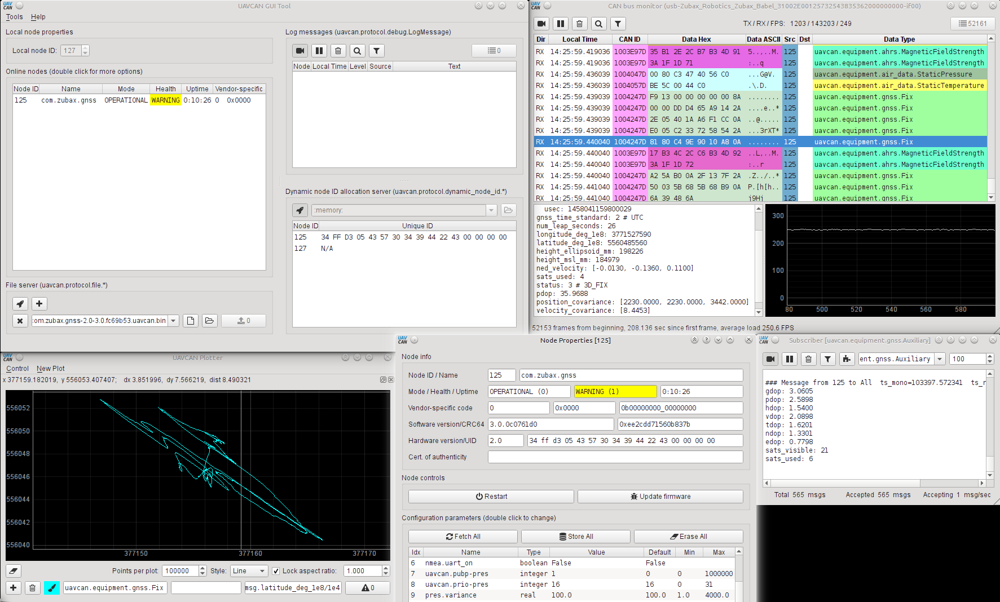

UAVCAN GUI Tool (legacy)
========================

UAVCAN GUI Tool is a cross-platform (Windows/Linux/OSX) application for UAVCAN/CAN v0 management and diagnostics.

This is a legacy application; it is not compatible with the stable UAVCAN v1 and is no longer actively maintained.
**Users of UAVCAN v1 should use the [Yakut command line tool](https://github.com/UAVCAN/yakut) instead.**

Users who are looking for continued support of the legacy protocol should consider the fork named
[DroneCAN GUI Tool](https://github.com/dronecan/gui_tool).
The DroneCAN project is an independent effort to provide continued support
for the legacy UAVCAN/CAN v0 protocol under a new name.

[Read the docs at **legacy.uavcan.org/GUI_Tool**](http://legacy.uavcan.org/GUI_Tool).

[Ask questions at **forum.uavcan.org**](https://forum.uavcan.org).

Read installation instructions:

- [**GNU/LINUX**](#installing-on-gnulinux)
- [**WINDOWS**](#installing-on-windows)
- [**MACOS**](#installing-on-macos)



## Installing on GNU/Linux

The general approach is simple:

1. Install PyQt5 for Python 3 using your OS' package manager (e.g. APT).
2. Install the application itself from Git via PIP:
`pip3 install git+https://github.com/UAVCAN/gui_tool@master`
(it is not necessary to clone this repository manually).
Alternatively, if you're a developer and you want to install your local copy, use `pip3 install .`.

It also may be necessary to install additional dependencies, depending on your distribution (see details below).

Once the application is installed, you should see new desktop entries available in your desktop menu;
also a new executable `uavcan_gui_tool` will be available in your `PATH`.
If your desktop environment doesn't update the menu automatically, you may want to do it manually, e.g.
by invoking `sudo update-desktop-database` (command depends on the distribution).

It is also recommended to install Matplotlib - it is not used by the application itself,
but it may come in handy when using the embedded IPython console.

### Debian-based distributions

```bash
sudo apt-get install -y python3-pip python3-setuptools python3-wheel
sudo apt-get install -y python3-numpy python3-pyqt5 python3-pyqt5.qtsvg git-core
sudo pip3 install git+https://github.com/UAVCAN/gui_tool@master
```

#### Troubleshooting

If installation fails with an error like below, try to install IPython directly with `sudo pip3 install ipython`:

> error: Setup script exited with error in ipython setup command:
> Invalid environment marker: sys_platform == "darwin" and platform_python_implementation == "CPython"

If you're still unable to install the package, please open a ticket.

### RPM-based distributions

*Maintainers wanted*

#### Fedora 29+
```bash
sudo dnf install python3-PyQt5
sudo pip3 install git+https://github.com/UAVCAN/gui_tool@master
```

## Installing on Windows

In order to install this application,
**download and install the latest `.msi` package from here: <https://files.zubax.com/products/org.uavcan.gui_tool/>**.

### Building the MSI package

These instructions are for developers only. End users should use pre-built MSI packages (see the link above).

First, install dependencies:

* [WinPython 3.4 or newer, pre-packaged with PyQt5](http://winpython.github.io/).
Make sure that `python` can be invoked from the terminal; if it can't, check your `PATH`.
* Windows 10 SDK.
[Free edition of Visual Studio is packaged with Windows SDK](https://www.visualstudio.com/).

Having done that, execute the following (the script will prompt you for password to read the certificate file):

```dos
python -m pip uninstall -y uavcan
python -m pip uninstall -y uavcan_gui_tool
python setup.py install
python setup.py bdist_msi
```

Collect the resulting signed MSI from `dist/`.

## Installing on macOS

OSX support is a bit lacking in the way that installation doesn't create an entry in the applications menu,
but this issue should be fixed someday in the future.
Other than that, everything appears to function more or less correctly.
If you have a choice, it is recommended to use Linux or Windows instead,
as these ports are supported much better at the moment.

### Homebrew option

* Install the Homebrew package manager for OSX.
* Run the following commands:

```bash
brew install python3
brew postinstall python3
pip3 install PyQt5
pip3 install git+https://github.com/UAVCAN/gui_tool@master
uavcan_gui_tool
```

### MacPorts option

Install XCode from App Store, install MacPorts from <https://www.macports.org/install.php>,
then run the commands below.
If you're prompted to install Command Line Developer Tools, agree.

```bash
sudo port selfupdate
sudo port install curl-ca-bundle py35-pip py35-pyqt5 py35-numpy
sudo python3.5 -m pip install git+https://github.com/UAVCAN/gui_tool@master
```

We would like to provide prebuilt application packages instead of the mess above.
Contributions adding this capability would be welcome.

## Development

### Releasing new version

First, deploy the new version to PyPI. In order to do that, perform the following steps:

1. Update the version tuple in `version.py`, e.g. `1, 0`, and commit this change.
2. Create a new tag with the same version number as in the version file, e.g. `git tag -a 1.0 -m v1.0`.
3. Push to master: `git push && git push --tags`

Then, build a Windows MSI package using the instructions above, and upload the resulting MSI to
the distribution server.

### Code style

Please follow the [Zubax Python Coding Conventions](https://kb.zubax.com/x/_oAh).
