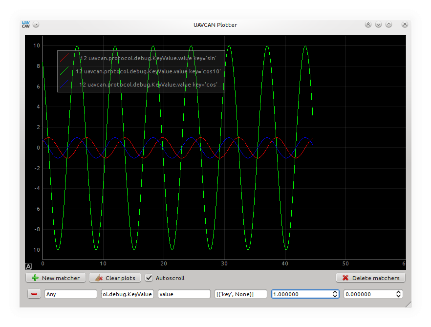

UAVCAN Plotter
==============

UAVCAN Plotter is a GUI plotting tool, like `rqt_plot` in ROS, that allows to plot arbitrary values from the bus.
The interface is more or less self-documenting.

This tool is deprecated and will be removed once its functionality is re-implemented in the UAVCAN GUI tool.

